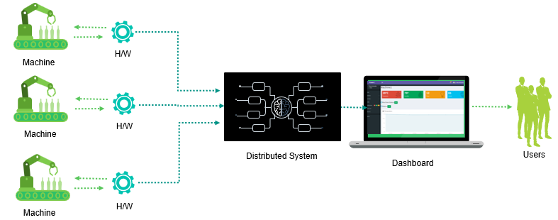
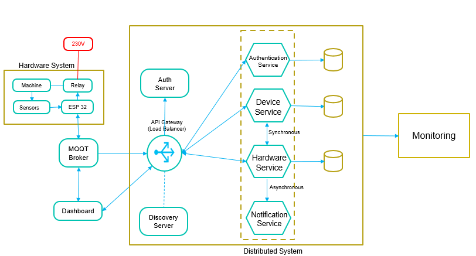
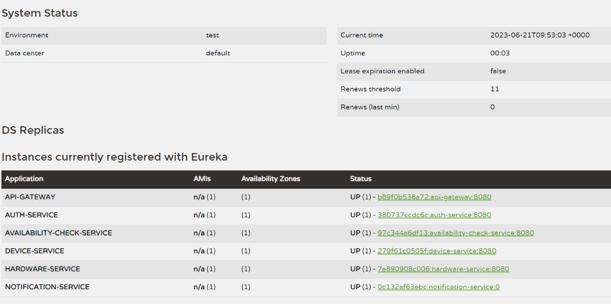
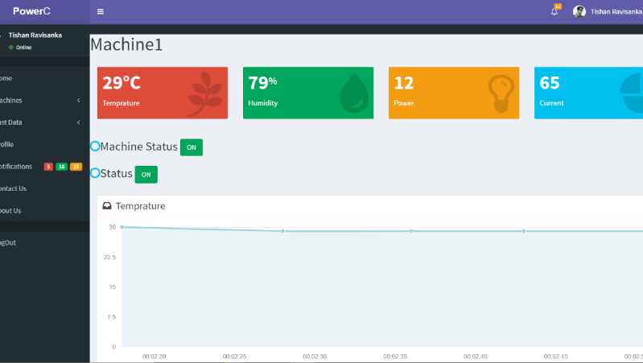
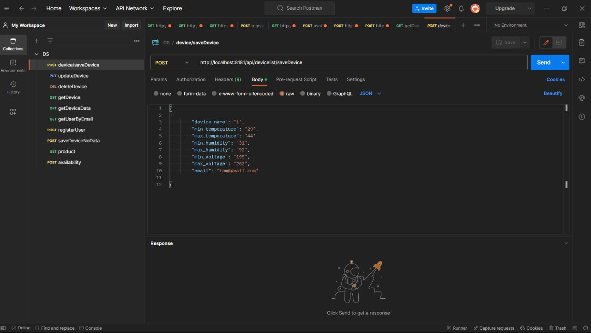
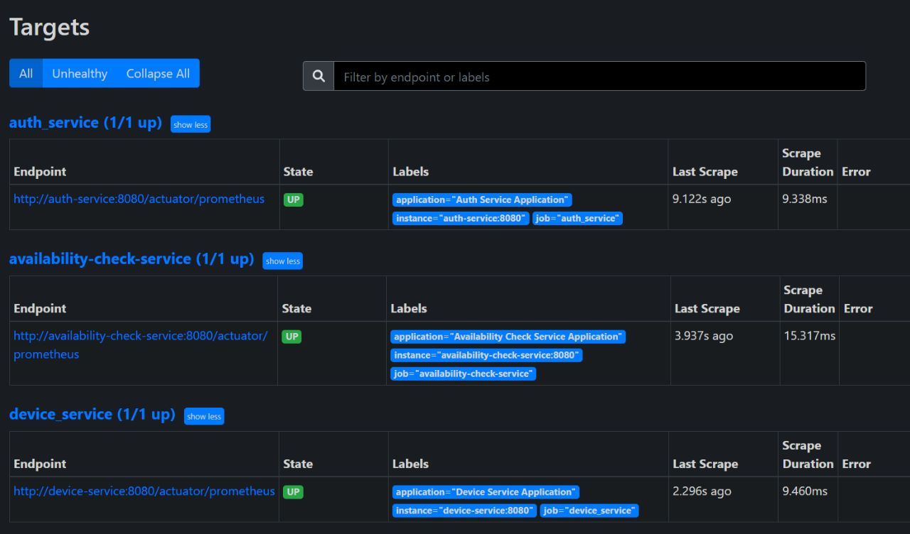
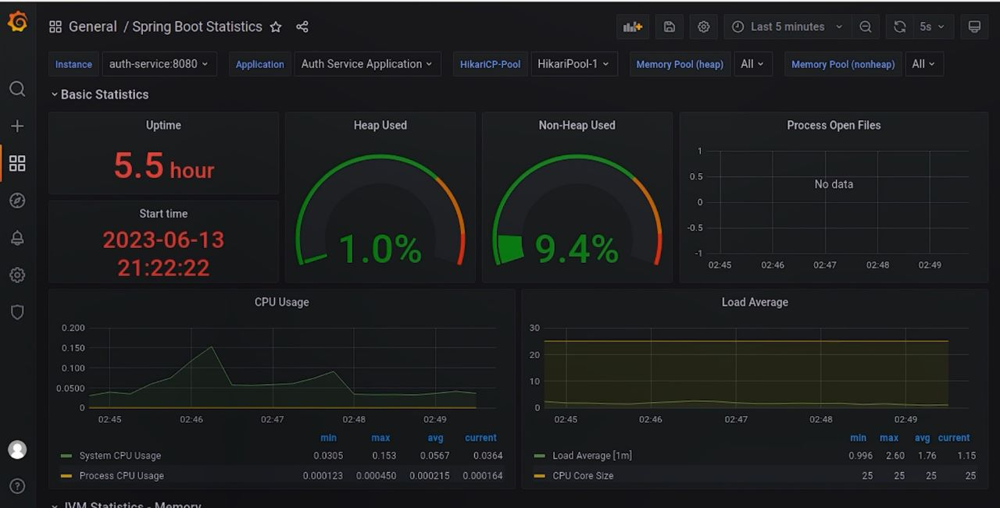
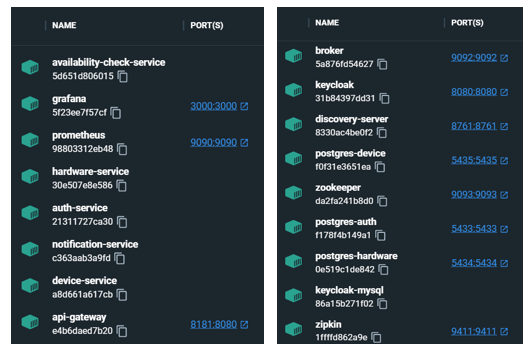

## Energy Monitoring System (CO4353 - Distributed Systems Project)

## Group Members (Group 6):

- 18/ENG/118	- K.T.R. WICKRAMASINGHE
- 18/ENG/073	- V.T. PATHIRAGE
- 18/ENG/093	- B.C.U. RANAWEERA
- 16/ENG/019	- G.R.L. CHANDRASEKERA

## Introduction

 

- This is an industry machine monitoring system.

- There are several machines that will be connected to wifi and send their matrices including energy data such as voltage, current, and power factor and also other data such as temperature humidity

- These data will be sent to our ds. 

- Those can be viewed and in case of failure like a temperature increase, it will be notified to the user.

 

### Problems

- When using different types of equipment and lights users may forget to turn off the power.
- So there must be someone to look after them but it is not that much successful and practical.
Also when many pieces of equipment need to be monitored it is difficult to monitor by a single human. Therefore it is not cost-effective.

### Solutions

- Automatic Shutting Down - Power C can react faster than a human so in a critical moment damage happens to the machine and can be reduced because of immediate actions.
- Low Reaction Time - The user can set a certain value to automatically shutdown of the machine in a critical moment through IoT dashboard. And it will shut down the machine as soon as possible
- Real-time Notifications and Data - The user will be informed about the real-time functioning of the machine and give warnings and give the current status of the machine(Temperature, Humidity, Power, Current, voltage, Frequency ) through the IoT dashboard.
- Reduce human involvement - Power C can remotely monitor the functioning of machines and reduce the cost for humans. It can read the status of the machines that are unreachable to humans(Extremely cold or hot). 

 

## Architecture

 

Shown below is the architectural diagram of our project.

 

### Design Decisions

There are 4 Services,

Each service was isolated based on the functionality and the database table separation.
For user management separate service was created and for managing the hardware data another service was created. And for managing devices and alerting separate services are created.

 

## Micro Services

 

### Technology Stack used

- Netflix Eureka Server was used as the discovery server
- Spring Cloud Gateway was used to implement the API Gateway
- Springboot for microservices building

 

### Core Services

Following are the core services of the project,

- Authentication Service - Signing in and signing up  dashboard users
- Device Service - Get or modify device configurations
- Hardware Service - Get the hardware system data and populate it in the database
- Notification Service - If the temperature is not in threshold send an email notification to the user.

 

**API endpoints exposed by microservices**

### Authentication Service
  > GET /api/user/getUserByEmail/{email} - handling user logins

  > POST /api/user/registerUser - new user registration 

### Device Service
  > GET /api/devicelist/getDevice - get all device data

  > GET /api/devicelist/getDeviceData/{email}- get a perticular user device data

  > POST /api/devicelist/saveDevice - add new device 

  > GET /api/devicelist/getDeviceExist/{name} - check availability of a device

  > PUT /api/devicelist/updateDevice - update device data

  > DELETE /api/devicelist/deleteDevice - delete device

### Hardware Service
  > POST /api/device/saveDeviceNoData - reveive perticular device data from hardware 

  > Kafka producer - nofificationTopic

### Notification Service
  > Kafka consumer - nofificationTopic

 

**Inter-service interactions**

### Asynchronous Communication (Kafka)

  When the temperature is higher than the maximum, hardware-service sends a message to notification-service 

### Synchronous Communication (Rest API)
When energy data comes to hardware-service, it checks whether the device exists or not by communicating with the device-service. (It waits for the device-service response)

### Other Communication (MQTT)
Receiving esp32 (publisher) hardware data via hive MQTT broker to a middleware (python subcriber)

 

### Discovery Server
Netflix Eureka was used as the discovery server. It acts as a centralized registry of all the available services. Without using IP addresses, port services can be discovered through this.
Services can be added or removed dynamically without affecting other services. 

 

### API Gateway

To implement the api gateway Spring Cloud gateway was used. It provides a library for building API gateways on top of Spring and Java.
Configured on port 8080.

 

### User Interface

- Laravel Framework
- Languages used: PHP, Javascript
- Other - ajax, jquery

 

### API Testing tool
PostMan is used as the development testing tool in developing each endpoint

 

### Authentication
- Server - Keycloak act as the identity and access management server enabling users to authenticate once and access multiple applications
- Protocol - OAuth2 allows users to grant access to resources with control
- Token - JWT provides a standardized format for secure token-based authentication

 

### Databases
- MongoDB
- PostgreSQL
- MySQL

 

### Monitoring
- Micrometer - Collects and publishes metrics related to spring boot application performance, resource utilization, and custom business metrics
- Prometheus - Uses a pull-based model to scrape metrics from applications, which are exposed by Micrometer (Collects and stores time-series data)

- Grafana - Provides GUI interfaces to explore and display metrics collected by Prometheus

## Deployement

- For all the core services and utility services, Docker containers were created and they were deployed.

## References

* About [Docker](https://www.docker.com/get-started/)
* About [Grafana](https://grafana.com/grafana/)
* About [Keycloak](https://www.keycloak.org/guides)
* About [Spring Boot](https://spring.io/guides/gs/spring-boot/)
* About [Laravel](https://laravel.com/docs/8.x/readme)
